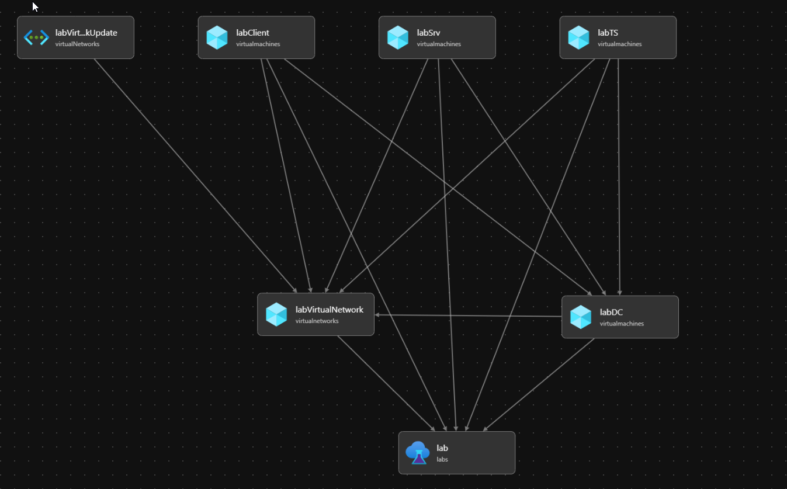

# Zero Networks Azure DevTest Lab Deployment
## Resources
This script will deploy a Dev Test Lab with 4 Servers.  The Domain Controller is the first server to be deployed and will create a new domain.  All other servers depend on the successful creatation of the DC.  

## Deployment
To run this, first create a Resource Group

`az group create --name ZN-Demo-Lab --location eastus`

Then deploy the bicep file

`az deployment group create --resource-group ZN-Demo-Lab --template-file main.bicep --parameters labName=zn-demo dnsPrefix=zndemo userName=ken domainName=zndemo domainFQDN=zndemo.com`
