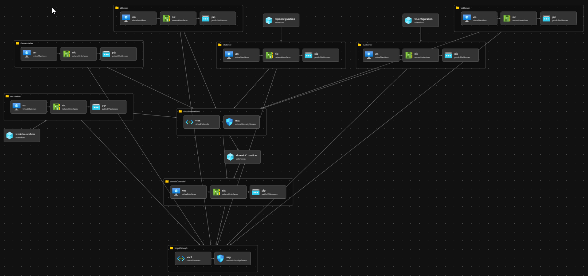

# Zero Networks Azure DevTest Lab Deployment
## Resources
This script will deploy a Dev Test Lab with 4 Servers.  The Domain Controller is the first server to be deployed and will create a new domain.  All other servers depend on the successful creatation of the DC.  



## Deployment
To run this, first create a Resource Group

```
$rg = "ZN-PARTNER-LAB"
az group create -n $rg -l eastus
```

Then deploy the bicep file

```
az deployment group create -g $rg  `
    --template-file main.bicep `
    --parameters adminUsername=znadmin `
    domainFQDN=zxdemo.local
```
